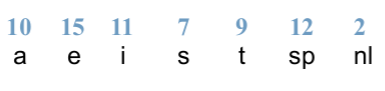
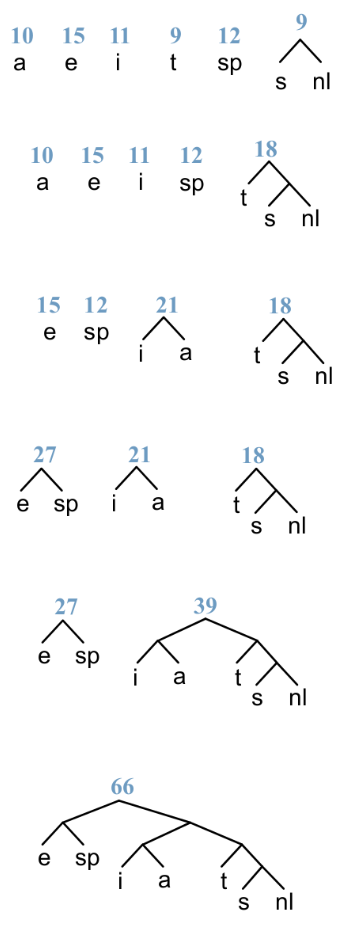

# Úloha č. 3: Kódovanie

**Zverejnenie úlohy:** 2.12.2017 

**Deadline:** 23.12.2017 23:59

Projekt môžte skompilovať pomocou nasledujúceho príkazu:

```bash
mvn clean install -Dcheckstyle.fail=true
```

Pokrytie testov nájdete po kompilácii v `target/site/jacoco/index.html`.

## Bodovanie

Maximálny počet bodov je **11**, body sú rozdelené nasledovne:

* **6.5 bodov** za prejdenie testov (priložené testy negarantujú 100% správnosť),
* **3.5 bodov** za správnu implementáciu (posúdia cvičiaci),
* **1 bod** za čístú a elegantnú implementáciu.

Ak verejné testy neprejdú, môžte získať maximálne **4 body**.

## Požiadavky

Pre úspešnú implementáciu by ste mali vedieť pracovať s:

* abstraktnými triedami,
* logickým porovnávaním,
* komparátormi,
* usporiadanými, neusporiadanými kolekciami a ich metódami,
* vstupom a výstupom.

Taktiež potrebujete pochopiť, ako funguje [**Huffmanovo kódovanie**](https://en.wikipedia.org/wiki/Huffman_coding),
pretože ho budete implementovať. **Prečítajte si celé zadanie!**

Vašou úlohou je vytvoriť triedy v balíčku `cz.muni.fi.pb162.hw03.impl` (a hlbšie).
Čokoľvek mimo tohto balíčku bude pri hodnotení ignorované.

## Vytvorenie základných tried

- Vytvorte triedu `SymbolFrequency` v `cz.muni.fi.pb162.hw03.impl`.
  Trieda slúži na ukladanie znaku a jeho počtu výskytov.
  Môžte predpokladať, že znak nikdy nebude `null`. Bude mať definované:

  - konštruktor s parametrami _znak_ a _počet výskytov_,

  - metódy rovnosti na príslušné atribúty,

  - gettery na príslušné atribúty,

  - `toString` bude vracať `14x'A'` pre 14 výskytov písmena A,

  - prirodzené usporiadanie bude primárne podľa frekvencie vzostupne (najprv 5, potom 8)
     a sekundárne v abecednom poradí (od A po Z).

> _Hint:_ Zíde sa vám metóda usporiadania v triede `Character`.

Vytvorte triedy reprezentujúce uzly v binárnom strome v `cz.muni.fi.pb162.hw03.impl.encoding.node`.
Triedy implementujú rozhranie `TreeNode`.
Každý uzol obsahuje `SymbolFrequency` a odkazy na ľavého a pravého potomka typu `TreeNode`.

  - Trieda `LeafTreeNode` reprezentuje list stromu a jeho potomkovia sú `null`.
      - Konštruktor má jeden parameter typu `SymbolFrequency`.
      - Metóda `toString` pre `14x'A'` vráti `Leaf 14x'A'`.
      - Dva listy sú rovnaké, keď majú rovnaký znak aj frekvenciu.

  - Trieda `InnerTreeNode` bude mať konštruktor s dvomi parametrami: ľavý a pravý potomok uzla.
    Reprezentuje vnútroný uzol stromu, znak uzlu je konštanta `EMPTY_CHAR`
    a frekvencia je súčet frekvencí jeho dvoch potomkov.
    Metóda `toString` vráti pre deti `3x'A'` a `2x'B'`reťazec `A-(5)-B` (5 je súčet frekvencí).
    Dva vnútorné uzly sú rovnaké, keď sa rovnajú ich ľavé a pravé deti.

  - Trieda `AbstractTreeNode` je abstraktná trieda, ktorá obsahuje funkcionalitu spoločnú pre oba typy uzlov.

Každý uzol taktiež implementuje metódu usporiadania `int compareTo(TreeNode o)` na uzloch stromu nasledovne:
  - primárne porovnáme uzly stromu podľa frekvencie
  - inak
      - ak porovnávame list a nelist, nelist je menší ako list, t.j. je v poradí skôr
      - ak porovnávame 2 listy, porovnáme podľa znaku
      - ak porovnávame 2 nelisty, porovnáme najprv podľa ľavého, potom podľa pravého potomka

## Vytvorenie komparátorov

Komparátory budu v balíčku `cz.muni.fi.pb162.hw03.impl.comparator`.

- Komparátor `SymbolFrequencyInverseComparator`, bude zoraďovať prvky
  v opačnom poradí prirodzeného usporiadania.

- Komparátor `SymbolFrequencyLetterInverseComparator`, bude zoraďovať prvky
  primárne podľa frekvencie vzostupne a sekundárne v opačnom abecednom poradí (od Z po A).

## Vytvorenie pomocných tried

### Konverter

Trieda `CollectionConverter` bude v balíčku `cz.muni.fi.pb162.hw03.impl.encoding.huffman`.
Bude obsahovať statické metódy, ktoré konvertujú kolekcie (metódy využijete pri vytváraní Huffmanovho kódovania):

- `NavigableSet<TreeNode> charSetToLeafNodeSet(Set<SymbolFrequency> charSet)`
    - berie množinu frekvencii znakov,
    - vráti množinu uzlov stromu usporiadanú podľa frekvencie,
    - v Huffmanovom kódovaní ide o krok _sprav z tabuľky les stromov_.

- `Map<Character, String> nodeMapToEncodingMap(Map<TreeNode, String> nodeStringMap)`
    - berie mapu uzol stromu - binárna reprezentácia uzlu (napr. `"100111010"`),
    - vráti mapu znakov a reťazcov ich binárnych reprezentácii,
    - ide prakticky o konverziu `TreeNode` na `Character` použitím `treeNode.getCharacter()`.

### [Kodek](https://en.wikipedia.org/wiki/Codec)

Trieda `BinaryCodecImpl` implementuje rozhranie `BinaryCodec` a bude v balíčku `cz.muni.fi.pb162.hw03.impl`.

Konštruktor berie ako parameter kódovanie (`Encoding`).

Jednotlivé metódy slúžia na zakódovanie a dekódovanie správy daným kódovaním.

## Huffmanovo kódovanie

Kódovanie (encoding) je reprezentácia znakov binárnym zápisom.
V úlohe sa zaoberáme iba kódovaním, v ktorom má každý znak priradenú binárnu reprezentáciu.

- Nasledujúce triedy patria do balíčku `cz.muni.fi.pb162.hw03.impl.encoding.huffman`.

- Implementujte rozhrania `Encoding` a `HuffmanAlgorithm`, vytvorením triedy `HuffmanEncoding`.
  Táto trieda reprezentuje Huffmanovho kódovanie.

- Toto kódovanie sa snaží minimalizovať binárnu správu tým, že minimalizuje dĺžku bitov častých znakov.
  Inými slovami, znaky, ktoré sa často vyskytujú, budú obsahovať krátku binárnu reprezentáciu.
  Málo časté znaky zas dlhú binárnu reprezentáciu.

- Jazyk binárnych reprezentácii musí byť _prefix-free_, inak by sme nevedeli jednoznačne určiť, o aký znak ide.
  Napríklad, jazyk _a = 10, b = 101, c = 0_, nie je _prefix-free_,
  pretože nevieme, či reťazec _1010_ reprezentuje "aa" alebo "bc".
  Prefix-free jazyky vieme zapísať do stromu tak, že každý kódovaný znak sa nachádza **iba v liste stromu**.
  Kódovanie potom nepotrebuje pevnú dĺžku binárnej reprezentácie znaku ani
  binárnu reprezentáciu oddelovača znakov, čo dokáže správu významne skrátiť.

Nastavenie kódovania sa skladá z viacerých krokov.

#### 0. Vytvorenie tabuľky frekvencí

Vytvorte triedu `FrequencyTable`, ktorá vezme správu a zistí počet výskytov každého znaku v správe.
Konštruktor bude obsahovať reťazec typu `String`.
Metóda `createTable()` vráti množinu typu `SymbolFrequency` usporiadaných podľa prirodzeného usporiadania.

> Na vypočítanie frekvencie znakov odporúčam využiť mapu, ktorú potom prevediete do množiny.

Príklad tabuľky:

| Symbol        | Frequency     |
|:-------------:|:-------------:|
| a             | 10            |
| e             | 15            |
| i             | 11            |
| s             |  7            |
| t             |  9            |
| sp  (space)   | 12            |
| nl (new line) |  2            |

> _Pozn.:_ V skutočnosti sa tabuľky frekvencí nevytvárajú, ale používajú sa už (pre daný jazyk) predvytvorené.

#### 1. Vytvorenie stromu

Na začiatku bude každý prvok z tabuľky tvoriť strom bez potomkov.
Každý strom obsahuje práve jeden symbol. Máme les jednoprvkových stromov.

Táto časť sa odohráva v metóde `frequencyTableToTree`. Metóda vráti odkaz na koreň stromu.

Opakuj až kým nevznikne jeden strom (|forest.size - 1| krát):
vezmi 2 stromy s najmenšou frekvenciou a spoj ich do do jedného.
Nový koreň nech má frekvenciu rovnú súčtu spojených stromov. Znakom nech je konštanta `EMPTY_CHAR`.

Nový koreň má dvoch potomkov: na _ľavej_ strane **strom s najmenšou frekvenciou** a
na _pravej_ strane **strom s druhou najmenšou frekvenciou**.
Hoci algoritmus toto poradie nešpecifikuje, testy toto poradie vyžadujú!
Ak majú rovnakú frekvenciu, nech algoritmus zvolí najprv to, ktoré je v abecede skôr.

> _Hint:_ Využite nadefinované usporiadanie v kolekciách, aby ste kolekciu nezoraďovali "ručne".

Príklad vzniku stromu (bez usporiadania):





#### 2. Uloženie binárnej reprezentácie

Posledným krokom je prejdenie stromu a uloženie **binárnej reprezentácie každého znaku**.
Nech vetva vľavo reprezentuje binárnu 0 a vetva vpravo reprezentuje binárnu 1.

Tabuľka reprezentácie symbolov potom vyzerá nasledovne:

| Symbol        | Representation|
|:-------------:|:-------------:|
| e             | 00            |
| sp  (space)   | 01            |
| i             | 100           |
| a             | 101           |
| t             | 110           |
| s             | 1110          |
| nl (new line) | 1111          |

Rekurzívna metóda `createCodeTree` vezme:
  - mapu, do ktorej bude ukladať binárnu reprezentáciu,
  - uzol stromu a
  - binárnu reprezentáciu uzla.

Na začiatku je mapa prázdna, uzlom stromu je koreň a binárnou reprezentáciou je prázdny reťazec.

Metóda prejde celý strom (od koreňa k listom) a postupne mapu naplní.

### Implementácia Huffmanovho kódovania

Konštruktor berie tabuľku frekvencí znakov.

Metódy z `HuffmanAlgorithm` sa použijú priamo v konštruktore, aby sa dali používať metódy z rozhrania `Encoding`.

Využite metódy triedy `CollectionConverter`.

## Práca so vstupom a výstupom

Implementujte rozhranie `ReadWriteIO` v balíčku `cz.muni.fi.pb162.hw03.impl`. Trieda sa bude volať `ReadWriteIOImpl`.

## Demo

Vašu implementáciu si môžete overiť spustením `Demo` triedy, ktorá zakóduje, dekóduje súbor
a nakoniec overí, či sa súbory rovnajú (príkazom `diff`).
Máte pripravené 2 súbory: krátky _test.txt_ a dlhý _midsummer.txt_.

Testy overujú, či je obsah pôvodnej a rozkódovanej správy rovnaký, tak dané súbory nemažte.

Konštanta `USED_FILE` definuje, ktorý súbor bude použitý, takže sa ju nebojte zmeniť.
